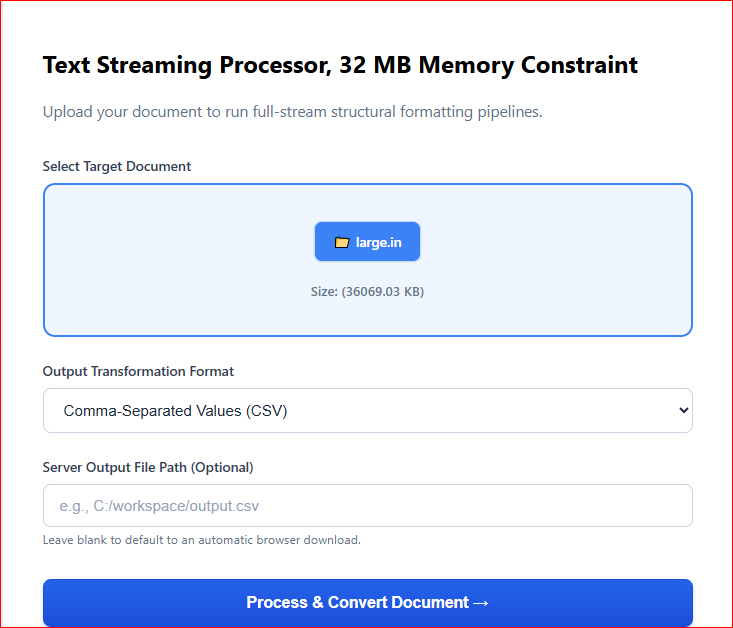
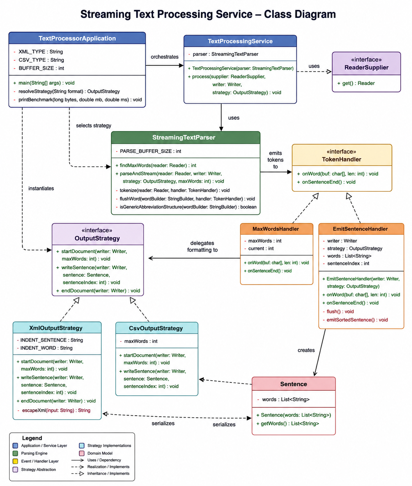

# Streaming Text Processing Service

A highly optimized, low-footprint enterprise Java application integrated with a modern Angular-driven dashboard to parse heavy text streams into structured XML or CSV formats. Words within sentences are automatically sorted in alphabetical order (case-insensitive).

This solution features a **Multi-Pass Streaming Architecture** designed to guarantee predictable memory usage and linear I/O complexity under a strict 32MB JVM heap constraint.

---

## 🖥️ Web User Interface Dashboard

The front-end client layer is built using Angular, delivering an elegant and intuitive data pipeline dashboard. It allows administrators to drop localized server disk paths, handle responsive form validation, monitor processing tracking modules, or pull direct browser application binary downloads.



### ✨ Core UI Capabilities
* **Dynamic Upload States:** Visually tracks file readiness with clear metadata details such as file sizes.
* **Simulated Non-Blocking Progress Module:** Swaps out static loading wheels with a smooth progress indicator bar that tracks parsing milestones natively without choking the browser's event loop thread.
* **Decoupled Stream Destination Routes:** Smart template handling routes back a success alert block on server-bound disk writes, or flips open an operational **💾 Download & View Output File** button upon network stream completions.

### 🔐 Secure Access Control Layer
Access to the dashboard configuration utilities is guarded by a clean, lightweight authentication form factor interface to prevent unauthenticated multi-part streaming tasks on system nodes.


---

## 📐 Architectural Constraints Met

### 1. 32MB Heap Limit Compliance
Traditional text processing tools parse datasets by reading files completely into memory or using an Object Tree (DOM parsing). That causes heap consumption to scale linearly with file sizes ($O(N)$ memory complexity), leading to immediate `OutOfMemoryError` crashes on large inputs.

This service eliminates memory scaling issues by implementing a **Streaming Pipeline**:
* **Sequential Extraction:** The parsing engine scans incoming streams utilizing high-performance array block buffers, processing structural units safely without heap explosions.
* **Immediate I/O Flushing:** Sentences are processed, locally sorted, converted to text lines, and immediately piped downstream using a `BufferedWriter`. Once written, elements leave the heap, keeping a flat memory footprint (~5–10MB) across massive inputs.
* **Multi-Pass Strategy (`ReaderSupplier`):** To correctly construct CSV structural table headers, the engine requires knowledge of the maximum word count before writing data rows. Instead of storing lines in memory, a custom `ReaderSupplier` abstracts file reopening between passes, enabling stateless streaming while supporting CSV header precomputation.

### 2. Smart Algorithmic Sentence Boundary Detection (Zero Hardcoding)
* **Non-Terminal Punctuation Scans:** A punctuation character (`.`, `!`, `?`) is algorithmically treated as part of an inline token and *not* a sentence break if it is immediately followed by an alphanumeric character without a space divider (e.g., `Mr.Young`, `i.e.`, `w.o.r.d`).
* **Generic Structural Title Filtering:** A standalone period (`.`) is prevented from triggering a boundary terminal split if the current word buffer context matches structural characteristics of initials or global title honorifics (containing only alphabetical letters with a length between 1 and 3 characters, such as `Mr.`, `Dr.`, `St.`, `vs.`, `A.`).
* This approach achieves zero-allocation evaluation constraints while natively supporting new titles or initials without requiring code alterations.

### 3. Behavioral Flexibility (Strategy Pattern)
To keep data conversion formats completely modular and decoupled from the parsing logic, the program uses a clean **Strategy Design Pattern**:
* `OutputStrategy`: The interface defining standard markup structural milestones.
* `XmlOutputStrategy`: Handles generation of structural elements and character escaping (`&amp;`, `&lt;`, `&gt;`, etc.).
* `CsvOutputStrategy`: Handles row indexing, structural padding, and dynamic header calculation.

### 4. Service Architecture Class Diagram
The class structure below illustrates the clean decoupling of our parsing engine from the presentation layer using the **Strategy Design Pattern**:



---

## 📂 Full-Stack Project Structure

```text
text-processing-service/
├── pom.xml                               # Backend Build Manifest
├── README.md                             # Documentation
├── frontend/                             # Angular SPA Architecture
│   └── src/app/components/text-processor/
│       ├── text-processor-component.html # Clean Flexbox Grid Card Form layout
│       ├── text-processor-component.css  # High-contrast premium corporate styling
│       ├── text-processor-component.ts   # Progress Bar tracker & state machine
│       └── text-processing.service.ts    # Decoupled Http POST Blob client
└── backend/
    └── src/main/java/com/textprocessor/
        ├── TextProcessorApplication.java # CLI Driver & Core Main
        ├── controller/
        │   └── TextProcessingController.java# CORS & ResponseEntity REST API Layer
        ├── model/
        │   └── Sentence.java             # Immutable sorted token container
        ├── parser/
        │   ├── StreamingTextParser.java  # Core parser with DI for abbreviations
        │   ├── TokenHandler.java         # Event interface for parsing hooks
        │   └── MaxWordsHandler.java      # Pass 1 statistics collector
        ├── service/
        │   └── TextProcessingService.java# Multi-pass lifecycle orchestrator
        └── output/strategy/
            ├── OutputStrategy.java       # Base interface
            ├── XmlOutputStrategy.java    # XML serialization
            └── CsvOutputStrategy.java    # CSV formatting logic


# Sample files for verification under: src/main/resources   
##How to Run

Backend Pipeline Activation

mvn clean install
mvn spring-boot:run

The service will expose the transformation pipeline endpoint at: http://localhost:8080/api/text/process

Frontend Development Launch

Navigate to your Angular folder, build dependencies, and start the node webserver:

npm install
ng serve --open

The web portal dashboard page will automatically render at: http://localhost:4200

Alternative Execution via CLI Driver

java -jar target/text-processing-service-0.0.1-SNAPSHOT.jar xml src/main/resources/small.in small-generate.xml

##Direct File Output:

java -jar target/text-processing-service-0.0.1-SNAPSHOT.jar xml input.txt output.xml

##Standard Output Redirection:

java -jar target/text-processing-service-0.0.1-SNAPSHOT.jar csv input.txt > output.csv

##Sample Output
#XML Mode:

	<text>
    <sentence>
        <word>a</word>
        <word>had</word>
        <word>lamb</word>
    </sentence>
	</text>
#CSV Mode:

	, Word 1, Word 2, Word 3
	Sentence 1, a, had, lamb

