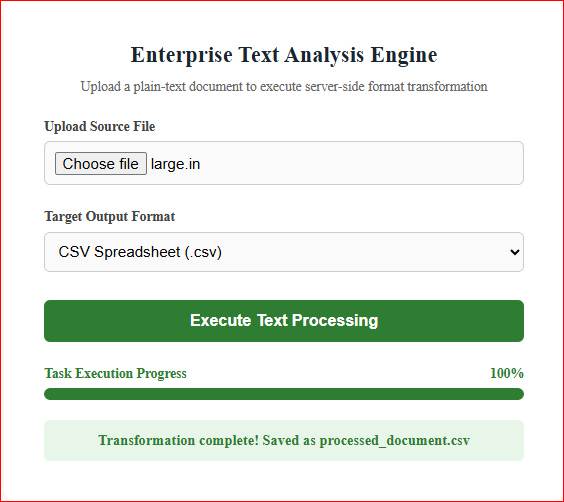
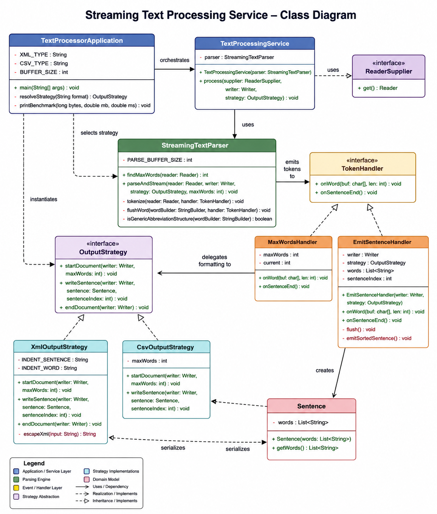

# Project Objective

The primary objective of this implementation is to demonstrate how a Java application can process potentially large text inputs under a strict memory constraint without relying on full in-memory representations.

The combination of:

- **streaming input processing**
- **multi-pass execution**
- **incremental output**
- **strategy-based formatting**
- **algorithmic sentence detection**
- **Angular-based monitoring UI**

provides a scalable foundation for memory-constrained text transformation workloads.
                                                       ## Enterprise Text Analysis Engine

A highly optimized, low-footprint enterprise Java application integrated with a modern Angular dashboard to process large text streams into structured **XML** or **CSV** formats.

Words within sentences are automatically sorted in **case-insensitive alphabetical order**.

The solution implements a **multi-pass streaming architecture** designed to maintain predictable memory consumption and linear I/O complexity under a strict **32 MB JVM heap constraint**.

## Secure Access Control

Access to the dashboard configuration and processing functionality is protected by a lightweight login interface.

<div align="center">
  <div style="
    display: inline-block;
    padding: 10px;
    border: 1px solid #d9dee5;
    border-radius: 8px;
    background: #ffffff;
    box-shadow: 0 2px 8px rgba(0, 0, 0, 0.08);
  ">
    
  </div>
</div>


### Dashboard

The frontend is built using **Angular**, providing an intuitive data-processing dashboard for configuring and monitoring text transformation jobs.

The dashboard allows users to:

- Specify server-side input and output file paths.
- Configure the desired output format.
- Validate processing parameters.
- Monitor processing progress.
- Download generated output files directly from the browser.

<div align="center">
  <div style="
    display: inline-block;
    padding: 10px;
    border: 1px solid #d9dee5;
    border-radius: 8px;
    background: #ffffff;
    box-shadow: 0 2px 8px rgba(0, 0, 0, 0.08);
  ">
    
  </div>
</div>

### Core UI Capabilities

#### Dynamic Upload States

Visually tracks file readiness and provides metadata such as:

- File name
- File size
- Processing state
- Validation status

#### Non-Blocking Progress Indicator

The UI replaces static loading indicators with a progress bar that communicates processing milestones without blocking the browser's event loop.

#### Decoupled Output Destinations

The frontend supports different output workflows depending on where the processed file is generated:

- **Server-side output:** Displays a success notification when the output has been written to disk.
- **Browser download:** Provides a **💾 Download & View Output File** action when the processed result is returned as a network response.

---


# Architectural Constraints

## 1. 32 MB Heap Limit Compliance

Traditional text-processing implementations often read an entire input file into memory or construct an in-memory object tree using approaches such as DOM parsing.

For large files, this causes memory consumption to grow with the size of the input and can ultimately result in:

```text
java.lang.OutOfMemoryError
```

This service avoids that problem through a **streaming pipeline**.

### Sequential Extraction

The parsing engine processes the input stream incrementally using buffered character processing rather than loading the complete document into memory.

Only the data required for the current processing operation is retained.

### Immediate I/O Flushing

Sentences are:

1. Extracted from the input stream.
2. Tokenized.
3. Sorted.
4. Converted into the required output representation.
5. Immediately written through a `BufferedWriter`.

Once written, processed data is no longer retained by the application.

This keeps memory usage substantially lower than an approach that stores the entire input document.

### Multi-Pass Strategy

CSV generation requires the maximum number of words appearing in any sentence before the header can be generated.

Instead of storing all sentences in memory, the implementation uses a `ReaderSupplier` abstraction that allows the input stream to be reopened for multiple passes.

Conceptually:

```text
Pass 1
  |
  +--> Scan input
  |
  +--> Determine maximum sentence width
  |
  v
CSV Header

Pass 2
  |
  +--> Reopen input
  |
  +--> Parse sentences
  |
  +--> Sort words
  |
  +--> Stream CSV rows
```

This provides the information required for CSV header generation without maintaining the complete dataset in memory.

---

## 2. Smart Sentence Boundary Detection

The parser implements algorithmic sentence-boundary detection without relying on a hardcoded list of every possible abbreviation.

### Non-Terminal Punctuation Detection

Punctuation characters such as:

```text
.
!
?
```

are not automatically treated as sentence boundaries.

For example:

```text
Mr.Young
i.e.
w.o.r.d
```

can contain periods that should not necessarily terminate a sentence.

The parser evaluates the surrounding character context before deciding whether punctuation represents a sentence boundary.

### Structural Title and Initial Detection

A standalone period is prevented from triggering a sentence boundary when the current token has characteristics consistent with a short title or initial.

Examples include:

```text
Mr.
Dr.
St.
vs.
A.
```

The approach uses structural characteristics such as:

- Alphabetic token content.
- Short token length.
- Immediate punctuation context.

This allows the parser to recognize new short-form titles or initials without requiring every possible title to be explicitly added to a hardcoded list.

---

## 3. Strategy Pattern for Output Formats

The text-processing engine is decoupled from the output format through the **Strategy Design Pattern**.

This allows XML and CSV generation to evolve independently from the parsing engine.

### `OutputStrategy`

Defines the common output contract used by the processing pipeline.

### `XmlOutputStrategy`

Responsible for:

- XML document structure.
- Sentence elements.
- Word elements.
- XML character escaping.

Examples of escaped XML characters include:

```text
&  -> &amp;
<  -> &lt;
>  -> &gt;
```

### `CsvOutputStrategy`

Responsible for:

- CSV header generation.
- Row generation.
- Sentence indexing.
- Dynamic column handling.
- Structural padding.

The architecture therefore allows additional output formats to be introduced without modifying the core parser.

---

## 4. Service Architecture

The following class diagram illustrates the separation between the parsing engine, processing service, output strategies, and API layer.



---

# 📂 Full-Stack Project Structure

```text
text-processing-service/
│
├── pom.xml
├── README.md
│
├── frontend/
│   └── src/
│       └── app/
│           └── components/
│               └── text-processor/
│                   ├── text-processor-component.html
│                   ├── text-processor-component.css
│                   ├── text-processor-component.ts
│                   └── text-processing.service.ts
│
├── backend/
│   └── src/
│       └── main/
│           ├── java/
│           │   └── com/
│           │       └── textprocessor/
│           │           │
│           │           ├── TextProcessorApplication.java
│           │           │
│           │           ├── controller/
│           │           │   └── TextProcessingController.java
│           │           │
│           │           ├── model/
│           │           │   └── Sentence.java
│           │           │
│           │           ├── parser/
│           │           │   ├── StreamingTextParser.java
│           │           │   ├── TokenHandler.java
│           │           │   └── MaxWordsHandler.java
│           │           │
│           │           ├── service/
│           │           │   └── TextProcessingService.java
│           │           │
│           │           └── output/
│           │               └── strategy/
│           │                   ├── OutputStrategy.java
│           │                   ├── XmlOutputStrategy.java
│           │                   └── CsvOutputStrategy.java
│           │
│           └── resources/
│               └── ...
│
└── docs/
    ├── login.PNG
    └── text-processor-uml.png
```

### Key Backend Components

| Component | Responsibility |
|---|---|
| `TextProcessorApplication` | Application entry point and CLI driver |
| `TextProcessingController` | REST API and HTTP response handling |
| `Sentence` | Immutable sentence/token representation |
| `StreamingTextParser` | Streaming parser and sentence boundary detection |
| `TokenHandler` | Parser event-processing interface |
| `MaxWordsHandler` | First-pass statistics collection |
| `TextProcessingService` | Multi-pass processing orchestration |
| `OutputStrategy` | Common output abstraction |
| `XmlOutputStrategy` | XML serialization |
| `CsvOutputStrategy` | CSV formatting and dynamic columns |

---

# 🚀 How to Run

## Backend

Build the application:

```bash
mvn clean install
```

Start the Spring Boot application:

```bash
mvn spring-boot:run
```

The REST API will be available at:

```text
http://localhost:8080
```

### Processing Endpoint

```text
POST http://localhost:8080/api/text/process
```

---

## Frontend

Navigate to the Angular application:

```bash
cd frontend
```

Install dependencies:

```bash
npm install
```

Start the development server:

```bash
ng serve --open
```

The dashboard will be available at:

```text
http://localhost:4200
```

---

# 🖥️ Alternative CLI Execution

The application can also be executed directly using the generated JAR.

## XML Processing

```bash
java -jar target/text-processing-service-0.0.1-SNAPSHOT.jar \
  xml \
  src/main/resources/small.in \
  small-generate.xml
```

## Direct File Output

```bash
java -jar target/text-processing-service-0.0.1-SNAPSHOT.jar \
  xml \
  input.txt \
  output.xml
```

## Standard Output Redirection

```bash
java -jar target/text-processing-service-0.0.1-SNAPSHOT.jar \
  csv \
  input.txt \
  > output.csv
```

---

# 📄 Sample Files

Sample input files for verification are available under:

```text
src/main/resources/
```

---

# 📤 Sample Output

## XML Mode

Example:

```xml
<text>
    <sentence>
        <word>a</word>
        <word>had</word>
        <word>lamb</word>
    </sentence>
</text>
```

---

## CSV Mode

Example:

```csv
,Word 1,Word 2,Word 3
Sentence 1,a,had,lamb
```

---

# 🔄 Processing Pipeline

The overall processing flow is:

```text
                Input File
                    |
                    v
          StreamingTextParser
                    |
                    v
          Sentence Detection
                    |
                    v
              Tokenization
                    |
                    v
       Case-Insensitive Sorting
                    |
                    v
             OutputStrategy
              /           \
             /             \
            v               v
      XML Output         CSV Output
            |               |
            v               v
       output.xml       output.csv
```

---

# Multi-Pass Processing Model

The processing model is intentionally designed around streaming rather than full-file buffering.

```text
                  INPUT STREAM
                       |
                       v
              +----------------+
              |     PASS 1     |
              +----------------+
                       |
                       v
           Calculate CSV metadata
           / maximum word count /
                       |
                       v
              +----------------+
              |     PASS 2     |
              +----------------+
                       |
                       v
            Stream and transform
                 each sentence
                       |
                       v
              +----------------+
              | Output Strategy |
              +----------------+
                  /         \
                 /           \
                v             v
              XML             CSV
```

This design allows the application to process large inputs while maintaining a small and predictable working memory footprint.

---

# Testing Considerations

The architecture supports testing at multiple levels:

### Parser Tests

Validate:

- Sentence boundary detection.
- Punctuation handling.
- Abbreviation-like structures.
- Tokenization.
- Case-insensitive ordering.

### Output Strategy Tests

Validate:

- XML structure.
- XML character escaping.
- CSV formatting.
- Dynamic column generation.
- Sentence numbering.

### Service Tests

Validate:

- Multi-pass processing.
- Strategy selection.
- Input/output lifecycle.
- Error handling.

### API Tests

Validate:

- REST endpoint behavior.
- Request validation.
- Response generation.
- File-processing workflows.

---

# ⚙️ Design Principles

The implementation is guided by the following principles:

- **Streaming over full-file buffering**
- **Low memory footprint**
- **Separation of concerns**
- **Strategy Pattern**
- **Single Responsibility Principle**
- **Dependency Injection**
- **Immutable domain representations**
- **Testability**
- **Format-independent parsing**
- **Deterministic processing**

---

#  Key Engineering Highlights

This project demonstrates several production-oriented engineering techniques:

| Area | Implementation |
|---|---|
| Language | Java 17 |
| Backend | Spring Boot |
| Frontend | Angular |
| Input Processing | Streaming parser |
| Memory Constraint | 32 MB JVM heap |
| Processing Model | Multi-pass |
| Output Formats | XML / CSV |
| Design Pattern | Strategy Pattern |
| Parsing | Incremental stream processing |
| Sorting | Case-insensitive alphabetical ordering |
| API | REST |
| CLI | Executable JAR |
| UI | Angular dashboard |
| Testing | Parser, service, strategy and API layers |

---
